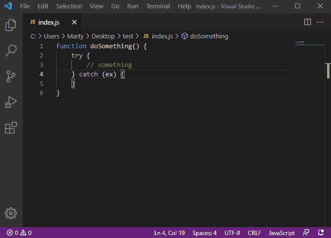

# Error Code Generator

Extension for generating error codes and automatically inserting them into the source code. Extension provide commands for insert generated error code by template and showing information about last used error code.

## Properties in settings

| Proeprty name                      | Description                                                                                            |
| ---------------------------------- | ------------------------------------------------------------------------------------------------------ |
| **error-code-generator.template**  | Template for the generate error. It should contain the substring "{{errorCode}}" define value counter. |
| **error-code-generator.initValue** | Initial value for counter.                                                                             |
| **error-code-generator.capValue**  | Cap value for counter. If value equal 0 then cap value is disabled.                                    |

## Comman list

| Command                                   | Description                                  |
| ----------------------------------------- | -------------------------------------------- |
| **error-code-generator.insert**           | Insert generated error code into source code |
| **error-code-generator.showLastErrorCode**| Show last used error code                    |

## How to use?

### First way

Call command from cammand pallet (Hotkey *F1* or *Ctrl+Shift+P*)



### Second way (recommended)

Bind commands to hotkey and use their.

```json
[
    {
        "key": "ctrl+shift+6",
        "command": "error-code-generator.insert",
        "when": "editorTextFocus"
    },
    {
        "key": "ctrl+shift+0",
        "command": "error-code-generator.showLastErrorCode"
    }
]
```